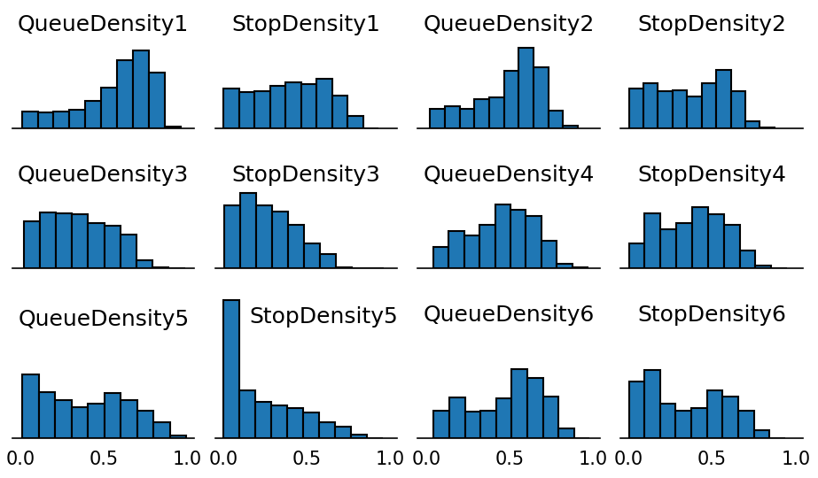

## Delhi Traffic Density Dataset

The traffic density dataset is collected from busy traffic intersection in Delhi between Sep to Dec 2020. 
Due to multiple device failures and maintenance related issues, we could collect 40 days complete data in this duration.

### Setup

With the help of our industry collaborator, we installed 6 cameras on the 3 intersections at the intersection as shown in the image.
Each approach has two cameras installed on a pole. 
Like Camera 1 looks on the front side of vehicles approaching the intersection 
whereas Camera 2 looks at the back of vehicles approaching the intersection. 
In the image below, Left is Camera1 and Right is Camera2.

### Traffic Processing

We process the traffic using the density measure for 
(1) better approximation of real ground traffic and 
(2) compute efficient design.

We provide the Traffic Density in two measures -

(1) _Queue Density_ : The traffic density accounting all the vehicles present in the road near the intersection.

(2) _Stop Density_ : The traffic density accounting the stopped vehicles present in the road near the intersection.

The below image shows the background subtraction mechanism to calculate Queue and Stop densities. 
Two filters with different learning rates are used in the process, along with optical flow mechanism.

We processed all the camera feeds and calculated these traffic density measures per second per camera on a 
low-cost embedded platform, having 1.8 GHz Intel(R) Atom(TM) CPU D525 with 4 logical cores and 8GB RAM.
Our dataset provides the 12 recordings per second from 7 AM to 10 PM for 40 days.

Epoch Time is used for marking the time at which the densities were processed. 

### Dataset Snapshot

Below is a snapshot of the data from Sep 12, 2020.

## Characteristics of the dataset

(1) No data is missing for the given 40 days for any camera.

(2) The Stop Density is always less or equal to the Queue Density.

### Data Availability

Above image shows the state of traffic data available from the intersection. 
As we see, we have a full working system only for 40 days.
On other days, there were issues like camera power failure, power adaptor failure, 
communication line failure between camera and compute device, compute device hang or power off, etc.

### Distribution of Hourly densities for the 3 approaches

In the above image, the horizontal axis denote the hour of the day, 
and vertical axis denote the Queue Density. 
For the Approaches 1 and 2,
the box-plot shows the peak traffic during morning and evening hours. 
The approach 3 (the one with cameras 5 and 6),
has an independent pattern where the traffic increases as the day progresses. 
The variation in density at each hour over the 40 days, 
show how dynamic traffic is at this Delhi intersection.

### Histograms of the densities for 40 days

## Dataset

The 40 days dataset can be downloaded from [here](DelhiTrafficDensityDataset.zip).

### Individual Dataset Links

September 2020: [Sep12](dataset/Sep12.csv.gz), [Sep13](dataset/Sep13.csv.gz), [Sep14](dataset/Sep14.csv.gz), [Sep15](dataset/Sep15.csv.gz), [Sep16](dataset/Sep16.csv.gz), [Sep17](dataset/Sep17.csv.gz), [Sep18](dataset/Sep18.csv.gz), [Sep19](dataset/Sep19.csv.gz), [Sep20](dataset/Sep20.csv.gz), [Sep22](dataset/Sep22.csv.gz), [Sep23](dataset/Sep23.csv.gz), [Sep26](dataset/Sep26.csv.gz), [Sep29](dataset/Sep29.csv.gz), [Sep30](dataset/Sep30.csv.gz)

October 2020: [Oct1](dataset/Oct1.csv.gz), [Oct2](dataset/Oct2.csv.gz), [Oct3](dataset/Oct3.csv.gz), [Oct4](dataset/Oct4.csv.gz), [Oct5](dataset/Oct5.csv.gz), [Oct6](dataset/Oct6.csv.gz), [Oct7](dataset/Oct7.csv.gz), [Oct8](dataset/Oct8.csv.gz), [Oct9](dataset/Oct9.csv.gz), [Oct10](dataset/Oct10.csv.gz)

November 2020: [Nov16](dataset/Nov16.csv.gz), [Nov17](dataset/Nov17.csv.gz), [Nov18](dataset/Nov18.csv.gz), [Nov22](dataset/Nov22.csv.gz), [Nov23](dataset/Nov23.csv.gz), [Nov24](dataset/Nov24.csv.gz), [Nov25](dataset/Nov25.csv.gz), [Nov26](dataset/Nov26.csv.gz), [Nov27](dataset/Nov27.csv.gz), [Nov28](dataset/Nov28.csv.gz)

December 2020: [Dec8](dataset/Dec8.csv.gz), [Dec15](dataset/Dec15.csv.gz), [Dec16](dataset/Dec16.csv.gz), [Dec17](dataset/Dec17.csv.gz), [Dec18](dataset/Dec18.csv.gz), [Dec19](dataset/Dec19.csv.gz)

### Disclaimer

This dataset is collected by IIT-Delhi team and industry partner collaboration.
For any queries, kindly contact: _riju@cse.iitd.ac.in_
